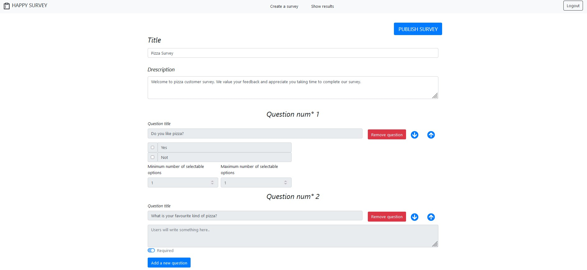

# Exam #1: "Questionario"
## Student: s290393 PALADINO MARIAGRAZIA 

## React Client Application Routes

- Route `/`: page content and purpose
- Route `/surveys`: if the user is logged-in, the page shows the list of his/her surveys. 
                    If the user is not logged-in, the page shows the list of all surveys that he/she can fill in.
- Route `/login`: the page allow an user to do login. 
- Route `/createSurvey`: if the user is logged-in, the page allows him/her to create a new survey.
- Route `/surveys/:param`: if the user is not logged-in, the page allows him/her to fill a form identified by `param`. 
- Route `/surveys/:param/submissions`:  if the user is not logged-in, the page shows the list of all users that have submitted the form identified by `param` with their answers.

## API Server


    [HTTP Method] [URL, with any parameter]
    [One-line about what this API is doing]
    [Sample request, with body (if any)]
    [Sample response, with body (if any)]
    [Error responses, if any]


- POST `/api/sessions`
  - Description: authenticate the user who is trying to login
  - Request body: credentials of the user who is trying to login

  ```
  {
      "username": "username",
      "password": "password"
  }
  ```
  - Response: 200 OK (success)
  - Response body: authenticated user

  ```
    {
        "id": 2,
        "username": "mario.rossi@polito.it", 
        "name": "Mario Rossi"
    }
  ```
- Error responses: 401 Unauthorized User (login failed), 422 Unprocessable Entity (values do not satisfy validators).


- GET `api/sessions/current`
 - Description: check if the current user is logged in and get her data
 - Request body: None
 - Response: 200 OK (success)
 - Response body: authenticated user
  ```
    {
        "id": 2,
        "username": "mario.rossi@polito.it", 
        "name": "Mario Rossi"
    }
  ```
  - Error responses: 401 Unauthorized User (user is not logged in)


- DELETE `api/sessions/current`
  - Description: logout current user
  - Request body: None
  - Response: 200 OK (success)
  - Response body: None
  - Error responses:  401 Unauthorized User (user is not logged in)


- GET `/api/surveys`
  - Description: Get the full list of surveys
  - Response: 200 OK (success)
  - Response body: the list of surveys
  ```
    {
        "id": 1,
        "title": "Customer satisfaction survey", 
        "description": "This survey was created in order to get information about customer satisfaction",
        "admin": 1
    }
  ```
  - Error responses:  401 Unauthorized User (user is not logged in), 422 Unprocessable Entity (values do not satisfy validators), 503 Service Unavailable (database error)

- POST `/api/surveys`
  - Description: Add a new survey to the surveys of the logged user
  - Request body: description of the object to add 
     ```
      {
          "title": "Customer satisfaction survey", 
          "description": "This survey was created in order to get information about customer satisfaction",
          "questions": 
            [
              { id: 1
                titleQuestion:"What do you think about the product?"
                min:0
                max:1
                position:0
                content: ["Good", "Bad"]
              }
            ]
      }
    ```
  - Response: 201 Created (success)
  - Response body: id of the survey inserted in the db.
  - Error responses: 422 Unprocessable Entity (values do not satisfy validators), 503 Service Unavailable (database error)


- GET `/api/surveys/:id`
  - Description: Get the list of all questions corresponding to the survey id
  - Request body: None
  - Response: 200 ok (success)
  - Response body: 
  ```
    [
      { id: 1
        title:"What do you think about the product?"
        min:0
        max:1
        position:0
        content: ["Good", "Bad"]
        }
      ]
  ```
   - Error responses:  401 Unauthorized User (user is not logged in), 422 Unprocessable Entity (values do not satisfy validators), 500 Internal Server Error

- GET `/api/admins/:id/surveys`
  - Description: Get the full list of surveys of the user identified by id
  - Response: 200 OK (success)
  - Response body:
  ```
    {
        "id": 1,
        "title": "Customer satisfaction survey", 
        "description": "This survey was created in order to get information about customer satisfaction",
        "admin": 1
    }
  ```
  - Error responses:  401 Unauthorized User (user is not logged in), 422 Unprocessable Entity (values do not satisfy validators), 503 Service Unavailable (database error)

- GET `/api/surveys/:id/submissions`
  - Description: Get the full list of submissions of the survey identified by id
  - Response: 200 OK (success)
  - Response body:
    ```
    [{
       "userID": 1,
        "nameUser": "Luca Neri", 
        "closeAnswers": [{questionID: 1, title: "What do you think about the product?", 
        choiceID: 1, text: "Good" , value:1, position:0}],
        "openAnswers": [{questionID: 1, title: "What do you think about this survey", text: "It is an interesting survey", position:0}],
    } ]
    ```
  - Error responses:  401 Unauthorized User (user is not logged in), 422 Unprocessable Entity (values do not satisfy validators), 503 Service Unavailable (database error)

- POST `/api/surveys/:id/submissions`
  - Description: Add a user submission in the list of the submissions of the form identified by id
  - Request body: description of the object to add 
     ```
    {
        "userID": 1,
        "nameUser": "Luca Neri", 
        "openAnswers": [{questionID: 1,  text: "Good" }],
        "closeAnswers": [{questionID: 1, choice: 1 , value:1 }],
    }
    ```
  - Response: 201 Created (success)
  - Response body: none
  - Error responses: 422 Unprocessable Entity (values do not satisfy validators), 503 Service Unavailable (database error)

## Database Tables

- Table `admins` 
  - contains id (primary key), name, email, hash
  - store the information about the name and the email, the hash column keeps the hashes for the users' passwords
- Table `surveys` 
  - contains id (primary key), title, admin (foreign key), description, nSubmissions
  - store the main information about the survey
- Table `questions` 
  - contains id(primary key), title, min, max, survey (foreign key), position
  - store the information about the questions
- Table `choices` 
  - contains id(primary key), text, question (foreign key)
  - if a question is close/multiple question, all the possible options are stored here.
- Table `closeAnswers` 
  - contains userID, nameUser, choice (foreign key), value
  - it stores all the close/multiple answers. For each option of the survey and for each user submission of the survey, the value of the option is stored in this table
- Table `openAnswers` 
  - contains userID, nameUser, question, text
  - For each open question of the survey and for each user submission of the survey, the user's answer is stored in this table
  
## Main React Components

- `LoginForm` (in `Login.js`):  renders the form to input the nickname and the password, redirecting to the home page in case of success or showing an error message in case of failure. For the last one, see the `AlertBox` in `Message.js`
- `SurveysList` (in `SurveysList.js`): renders the list of surveys. If the user is logged in , only her/his surveys are showed.
- `SubmissionForm` (in `Submission.js`): the component is responsible for rendering the anwers of a users for a certain survey if the user is logged in, otherwise the component is responsable for the compilation of the form by a user
- `SubmissionsList` (in `SubmissionList.js`): component responsible for rendering the anwers of the users for a certain survey 
- `CreateSurveyForm` (in `CreateSurvey.js`):   component responsible for rendering the form used for the creation of a new survey

## Screenshot



## Users Credentials

- email: mario.rossi@polito.it, password: MarioRossi (main user) 
- email: luca.neri@polito.it , password: LucaNeri (secondary user)
- email: andrea.bianchi@polito.it, password: AndreaBianchi
